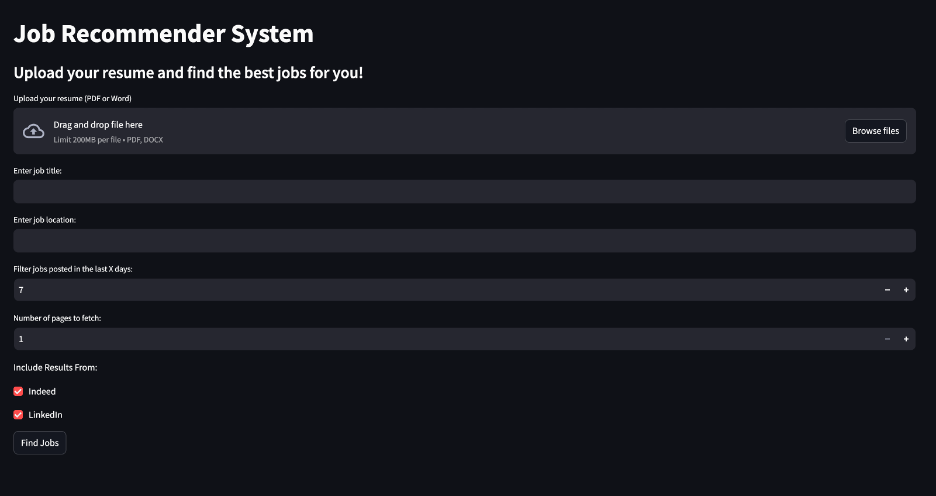
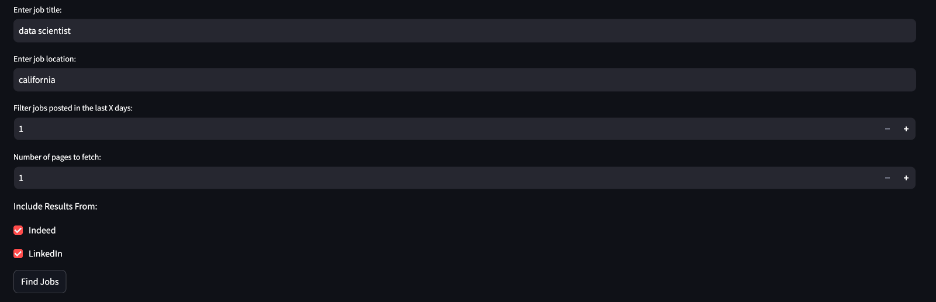
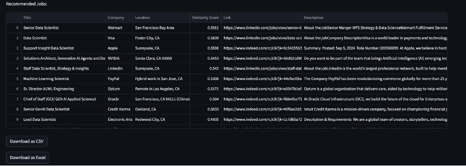

# Job Recommender System Application

## Overview
The **Job Recommender System** helps users upload their resumes and find jobs tailored to their skills and preferences. By leveraging advanced similarity scoring and external job search APIs, the app matches users with the most relevant job opportunities.

### Key Features
- **Resume Upload**: Users can upload their resumes in PDF or Word format.
- **Job Search**: Enter job title and location to find relevant opportunities.
- **Filters**: Customize the search with options like days old, number of pages, and job sources (Indeed, LinkedIn, etc.).
- **Similarity Scoring**: Matches jobs to the uploaded resume based on content similarity.
- **Download Results**: Export recommended jobs in **CSV** or **Excel** format.

### Automated Job Search Pipeline 🚀


### Upload Resume for AI Analysis


### Highly Configurable Job Searching 🧐


## Technologies Used
- **Frontend**: [Streamlit](https://streamlit.io/) for a lightweight, interactive UI.
- **Backend**: Python Flask API (assumed running on `http://127.0.0.1:5001`).
- **Job Search**
  - **`requests`**: For making API calls to job platforms (e.g., LinkedIn, Indeed).
  - **`BeautifulSoup` (from `bs4`)**: For web scraping and parsing HTML content from job listings (if applicable).
  - **`re`**: For cleaning and extracting data from job descriptions.
- **Resume and Job Description Similarity Scoring**:
  - **`gensim`**: Implements Doc2Vec for vectorizing resumes and job descriptions.
  - **`nltk`**: Provides tools for text tokenization, stopword removal, and preprocessing.
  - **`scikit-learn`**: Used for calculating cosine similarity and other preprocessing utilities.
  - **`PyPDF2`**: For extracting text content from PDF resumes.


# Installation Guide

📋 This guide will walk you through the installation process for the program. Please follow the steps below to ensure a successful installation.

## Setup and Instructions

### Prerequisites

Before proceeding with the installation, please make sure you have the following prerequisites:
- Python 3.8 or above installed.
- Access to a Linux terminal (Mac or Ubuntu) or a WSL on Windows
- Subscription to Rapidapi and the Linkedin Job search service: [Rapidapi](https://rapidapi.com/jaypat87/api/linkedin-jobs-search)


### Step 0: Clone the repository and create a virtual environment and install the software.
Clone the repository to your local environment and create the virtual environment.

```bash
conda create --name jobhunter python=3.10
conda activate jobhunter
pip install .
```

### Step 1: Install Required Libraries
Run the following command in your terminal to install the dependencies:
```bash
pip install -r requirements.txt
```

### Step 2: Copy the .env-template
To begin, we need to copy the `.env-template` file into `.env` so that the program can work properly. Use the following command to accomplish this:

```shell
cp .env-template .env
```

### Step 3: Add required API Key
### Add Rapid API KEY
Next, open the `.env` file in a text editor and add your Rapid API Key. This key is required for the program to function correctly. If you don't have a Rapid API Key, you can sign up for one [here](https://www.rapidapi.com/).

### Add OpenAI API KEY (Optional)
You can also add OpenAI API key to the `.env` file to get GPT based resume similarity score. This is optional feature, and currently in development, and will be available in full version soon. You can sign up for OpenAI API [here](https://platform.openai.com/apps)

### Add LinkedIn Credentials
Add your LinkedIn email and password to the .env file. These credentials are required to fetch job data directly from LinkedIn. Ensure that your credentials are kept secure and are not shared.


### Step 4: Run the Backend API
The backend API is assumed to be running on `http://127.0.0.1:5001`. Ensure that:
- The API endpoint `/recommend_jobs` is operational.
- The API processes POST requests with the following JSON payload:
  ```json
  {
    "resume": "<resume_text>",
    "job_title": "<job_title>",
    "location": "<job_location>",
    "days_old": <number_of_days>,
    "num_pages": <number_of_pages>,
    "include_indeed": true,
    "include_linkedin": true
  }
  ```

To start your backend API:
```bash
python app.py
```

### Step 5: Run the Streamlit Frontend
To launch the frontend:
```bash
streamlit run main.py
```

### Final Step: Hit the Run Button

ℹ️ NOTE: You can check the terminal to see the logs of the application when running.

That's it! You have successfully installed the program. 

🌐 You should be able to access the application in your browser by clicking [here](http://localhost:8501/).

You should see the UI like this:



If you encounter any issues during the installation process, please refer to the documentation or submit an issue to this repo.


## Usage Instructions
1. Open the app in your browser. The default URL is: `http://localhost:8501`.
2. Upload your resume (PDF or Word format).
3. Enter job details (e.g., title, location) and apply additional filters.
4. Click the **"Find Jobs"** button to fetch recommendations.
5. View the recommended jobs in a table and download the results in **CSV** or **Excel** format.


## Troubleshooting
- **API Connection Issues**:
  - Ensure the backend API is running at `http://127.0.0.1:5001`.
  - Verify the `/recommend_jobs` endpoint is reachable.
- **Dependency Errors**:
  - Run `pip install --upgrade <library>` to ensure libraries are up to date.
- **File Upload Issues**:
  - Check file permissions for uploaded resumes.
  - Verify the file format (only PDF and Word are supported).


## Future Enhancements
- Add support for additional job sources like Monster and Glassdoor.
- Integrate a progress bar for job search.
- Enhance similarity scoring with advanced NLP models like BERT.
